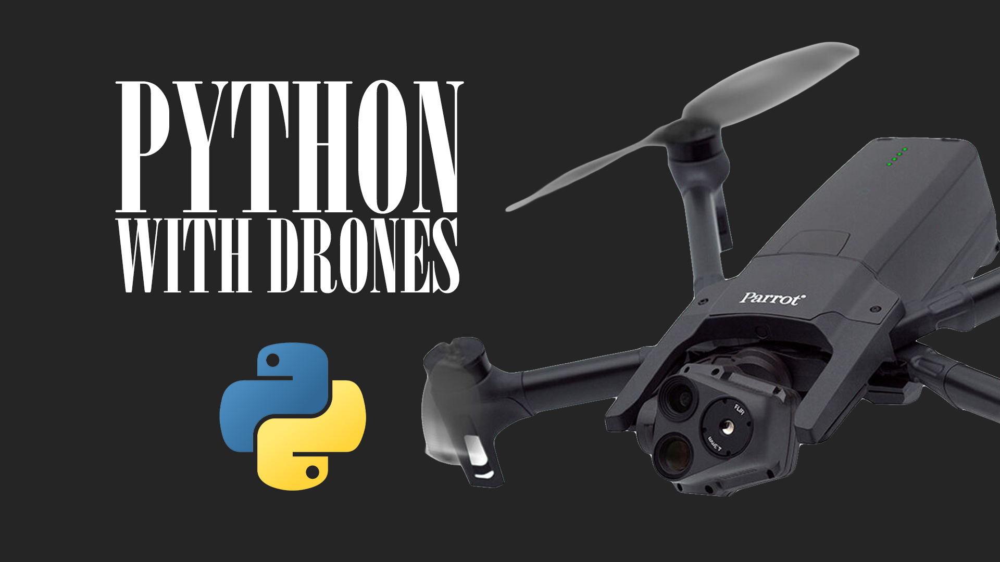

# pytronix


<div align="center">
  <p>
    <a href="" target="_blank">
      </a>
    <!--
    <a align="center" href="https://ultralytics.com/yolov5" target="_blank">
      </a>
    -->
  </p>
</div>


Python tutorial package for [Parrot Anafi](https://www.parrot.com/en/) drones. Based on Official [Parrot Olympe](https://developer.parrot.com/docs/olympe/index.html) (Python SDK) and [Parrot Sphinx](https://developer.parrot.com/docs/sphinx/index.html) (UE4 simulation tool).

* Author: [Amir Ebrahimnezhad](https://amirtronix.com)
* Maintainer: [Amir Ebrahimnezhad](https://amirtronix.com)


## Table of Contents

- [Ubuntu](#ubuntu)
- [Nvidia Driver](#nvidia-driver)
- [CUDA](#cuda)
- [Python Env](#python-env)
- [Olympe](#olympe)
- [Sphinx](#sphinx)
- [ROS Noetic](#ros-noetic)
- [Python Requirements](#python-requirements)


Please follow the following instructions carefully for setting up your development environment. If there are any issues with the installations or the codes, simply open a new issue request on the  [github repo](https://github.com/amirtronics/parrot_ros).


# Installation Guide

## Ubuntu 20.04

Install Ubuntu 20.04 dekstop image. Follow instructions on [ubuntu.com](https://releases.ubuntu.com/focal/). You can install it as dual-boot along your Windows but you can't use VM Ware as the GPU is inaccessible over virtual machine.

## Nvidia Driver

After installing Ubuntu, go ahead with installing the graphic card driver:

```
sudo apt-get install nvidia-driver-530
```

Reboot and verify the installation by:

```
sudo reboot 
nvidia-smi
```


## Python Env

First things first, you need to change teh default python command:

```
sudo apt install python-is-python3
```

Now install pip as:

```
sudo apt install python3-pip
```

Type python on terminal and double check the default python env which should be 3.8:

```
python
```


Before installing Parrot Olympe and other Python pacakges, it's needed to setup a virtual Python environment (let's call it parrot) for using a newer version of pip (20.3 or higher).

```
sudo apt install python3.8-venv
python -m venv parrot
source parrot/bin/activate
```

You'll see an indicator (parrot) on your terminal. Now you need to upgrade your pip on parrot env:

```
python -m pip install --upgrade pip
```

Double check you pip version, it should be 23.3:

```
pip --version
```

## Olympe


Now it's time or Olympe, make sure you're installing it on parrot env:

```
pip install parrot-olympe
```

Double check installation by importing it on parrot:

```
python
>>> import olympe
>>> quit()
```


## Sphinx

For simulating a drone and sending commands, we need to Parrot Sphinx simulator which is based on UE4 (Unreal Engine). 


```
curl --fail --silent --show-error --location https://debian.parrot.com/gpg | gpg --dearmor | sudo tee /usr/share/keyrings/debian.parrot.com.gpg > /dev/null
echo "deb [signed-by=/usr/share/keyrings/debian.parrot.com.gpg] https://debian.parrot.com/ $(lsb_release -cs) main generic" | sudo tee /etc/apt/sources.list.d/debian.parrot.com.list
sudo apt update
```

```
sudo apt install parrot-sphinx
```


Now it's time to install Parrot UE4:

```
sudo apt update
sudo apt install parrot-ue4-empty
```

To have access to pysphinx library run: (add to bash file)

```
. /opt/parrot-sphinx/usr/bin/parrot-sphinx-setenv.sh
```


### Wifi Fix

If your Wifi is disabled by running Sphinx, simply add wifi_iface="" to command line as follows:

```
sphinx "/opt/parrot-sphinx/usr/share/sphinx/drones/anafi_ai.drone"::firmware="https://firmware.parrot.com/Versions/anafi2/pc/%23latest/images/anafi2-pc.ext2.zip"::wifi_iface=""
```

## Python Requirements

```
pip install -r requirements.txt
```

